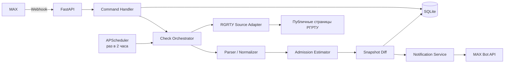

# Техническое задание: MAX-бот для мониторинга конкурсных списков РГРТУ

**Проект:** RGRTU Admission Monitor  
**Версия:** 1.0  
**Дата:** 29 июня 2026 года  
**Статус:** готово к разработке MVP  
**Основной пользователь:** родитель абитуриента  
**Отслеживаемый конкурсный балл по умолчанию:** 195

---

## 1. Назначение

Создать персонального чат-бота в MAX, который каждые 2 часа проверяет публичные конкурсные списки РГРТУ, оценивает положение абитуриента с заданным конкурсным баллом и уведомляет пользователя только при существенном изменении ситуации.

Бот должен заменить ручное открытие пяти конкурсных списков и постоянное сравнение количества мест, баллов, приоритетов, согласий и движения списка.

---

## 2. Цели продукта

Бот должен:

1. автоматически проверять РГРТУ раз в 2 часа;
2. отслеживать пять выбранных направлений;
3. отдельно анализировать бюджет и платное обучение;
4. рассчитывать не только сырое место, но и интервал возможной позиции;
5. учитывать доступные приоритеты, согласия, оригиналы и статусы заявлений;
6. сравнивать новый снимок с предыдущим;
7. отправлять уведомление только при значимом изменении;
8. позволять вручную запросить текущий статус;
9. позволять менять конкурсный балл;
10. хранить историю изменений;
11. явно показывать уровень достоверности прогноза;
12. не выдавать оценку за гарантию поступления.

---

## 3. Отслеживаемые направления

| Код | Направление | Общий конкурс 2026 | Платные места 2026 |
|---|---|---:|---:|
| 01.03.02 | Прикладная математика и информатика | 10 | 7 |
| 02.03.02 | Фундаментальная информатика и информационные технологии | 15 | 4 |
| 09.03.01 | Информатика и вычислительная техника | 59 | 20 |
| 09.03.02 | Информационные системы и технологии | 19 | 15 |
| 09.03.03 | Прикладная информатика | 20 | 18 |

Число мест хранится в базе/конфигурации и по возможности автоматически сверяется с официальной страницей РГРТУ.

---

## 4. Ключевые даты приёмной кампании 2026

| Событие | Дата |
|---|---|
| Начало приёма документов | 20 июня |
| Завершение приёма документов только по ЕГЭ | 25 июля, 17:00 МСК |
| Публикация официальных конкурсных списков | 27 июля |
| Окончание согласий приоритетного этапа | 1 августа, 12:00 МСК |
| Приказы приоритетного этапа | 3 августа |
| Окончание согласий основного этапа | 5 августа, 12:00 МСК |
| Приказы основного этапа | 7 августа |
| Завершение документов на платное | 19 августа |
| Завершение договоров на платное | 26 августа, 15:00 МСК |
| Приказы на платное | 27 августа |

До 27 июля все расчёты должны быть помечены как **предварительные**.

---

## 5. Исходная конфигурация MVP

```yaml
admission_year: 2026
university: РГРТУ
education_level: bachelor_specialist
study_form: full_time
default_exam_score: 195
individual_achievements: 0
check_interval_minutes: 120
timezone: Europe/Moscow
notifications_enabled: true
paid_enabled: true
```

---

## 6. Термины

**Конкурсный балл** — сумма результатов вступительных испытаний и индивидуальных достижений.

**Сырой список** — все валидные заявления по конкурсу без корректировки на приоритеты и согласия.

**Эффективный конкурент** — абитуриент, который по доступным данным сохраняет реальную возможность занять место.

**Сырая позиция** — место заданного балла среди всех заявлений.

**Эффективная позиция** — оценка места после учёта доступных приоритетов, согласий и статусов.

**Текущий проходной** — балл абитуриента на последнем доступном месте в текущей выборке.

**Снимок** — результат одной проверки одного конкурса в конкретный момент.

**Зона:**

- `PASSING` — проходная;
- `BORDERLINE` — пограничная;
- `NON_PASSING` — непроходная;
- `INSUFFICIENT_DATA` — данных недостаточно;
- `SOURCE_UNAVAILABLE` — источник временно недоступен.

---

## 7. Границы проекта

### 7.1. Входит в MVP

- один владелец бота;
- пять фиксированных направлений;
- бюджет и платное;
- балл, изменяемый командой;
- проверка каждые 2 часа;
- ручная проверка;
- уведомления при значимых изменениях;
- история;
- SQLite;
- Docker Compose;
- MAX Webhook;
- парсинг публичных страниц РГРТУ;
- историческая модель как вспомогательный прогноз;
- резервное копирование БД.

### 7.2. Не входит в MVP

- автоматическая подача заявлений;
- изменение приоритетов в личном кабинете;
- интеграция с Госуслугами;
- обход CAPTCHA или авторизации;
- мониторинг всех вузов;
- коммерческий многопользовательский сервис;
- гарантирование зачисления;
- хранение ФИО других абитуриентов.

### 7.3. Возможное развитие

- несколько пользователей;
- несколько вузов;
- точный поиск по анонимному номеру заявления;
- учёт разбивки баллов по предметам;
- точный tie-break при равных суммах;
- веб-панель;
- экспорт в Excel;
- графики изменения проходного;
- PostgreSQL.

---

## 8. Пользовательские сценарии

### US-01. Первичный запуск

1. Пользователь открывает бота.
2. MAX отправляет событие `bot_started`.
3. Бот проверяет авторизацию.
4. Если владелец не привязан, бот просит `/pair <код>`.
5. После привязки показывает балл, направления, интервал проверки и меню.

### US-02. Текущий статус

Команда:

```text
/status
```

Ответ содержит:

- время последней успешной проверки;
- возраст данных;
- статус каждого направления;
- число мест;
- позицию или интервал позиции;
- текущий/прогнозный проходной;
- изменение с прошлой проверки;
- confidence;
- платное отдельным блоком.

### US-03. Изменение балла

```text
/score 202
```

Бот валидирует значение, сохраняет его, пересчитывает последний снимок и использует новый балл в следующих проверках.

### US-04. Индивидуальные достижения

```text
/achievements 5
```

Допустимый диапазон: 0–10.

```text
total_score = exam_score + individual_achievements
```

### US-05. Ручная проверка

```text
/check
```

Бот немедленно запускает проверку. Параллельные проверки запрещены.

### US-06. Автоматическое уведомление

Сообщение отправляется, если:

- зона изменилась;
- официальный список появился впервые;
- изменилось число мест;
- проходной изменился минимум на заданный порог;
- позиция пересекла границу числа мест;
- появились данные о приоритетах или согласиях;
- источник недоступен слишком долго;
- опубликован приказ.

### US-07. История

```text
/history
```

Показываются последние 10 значимых событий.

### US-08. Одно направление

```text
/program 09.03.02
```

Возвращается детальный расчёт по указанному направлению.

---

## 9. Команды бота

| Команда | Назначение | Доступ |
|---|---|---|
| `/start` | старт и меню | разрешённый пользователь |
| `/status` | общий статус | разрешённый пользователь |
| `/check` | принудительная проверка | владелец |
| `/score <балл>` | изменение суммы ЕГЭ | владелец |
| `/achievements <0-10>` | изменение ИД | владелец |
| `/programs` | список направлений | разрешённый пользователь |
| `/program <код>` | детали направления | разрешённый пользователь |
| `/history` | история изменений | разрешённый пользователь |
| `/settings` | настройки | владелец |
| `/notifications on\|off` | уведомления | владелец |
| `/paid on\|off` | блок платного | владелец |
| `/pair <код>` | первичная привязка | непривязанный пользователь |
| `/debug` | диагностика без секретов | владелец |
| `/help` | справка | разрешённый пользователь |

Inline-клавиатура:

```text
[ Проверить сейчас ] [ Текущий статус ]
[ Изменить балл   ] [ История        ]
[ Только бюджет   ] [ Платное        ]
```

---

## 10. Источники РГРТУ

### 10.1. Основные источники

1. `https://postupai.rsreu.ru/guest/competition-lists`
2. `https://postupai.rsreu.ru/guest/entrant-lists`
3. `https://rsreu.ru/abitur/bachelor/tsifry-priema`
4. `https://rsreu.ru/abitur/bachelor/sroki-prijoma-dokumentov`
5. `https://rsreu.ru/abitur/bachelor/prikazy-o-zachislenii`
6. `https://rsreu.ru/abitur/bachelor/srednie-i-minimalnye-prokhodnye-bally`

### 10.2. Приоритет получения данных

1. Livewire payload официального интерфейса;
2. direct competition pages из `competitions[].id`;
3. последний успешный снимок при временной недоступности.

Запрещено:

- обходить CAPTCHA;
- использовать чужую авторизованную сессию;
- подбирать токены;
- делать избыточные запросы;
- сохранять ФИО.

### 10.3. Обязательный discovery перед разработкой

Разработчик должен:

1. открыть конкурсные списки в браузере;
2. изучить Network;
3. определить реальные запросы данных;
4. определить пагинацию;
5. найти идентификаторы пяти конкурсов;
6. сохранить примеры ответов в fixtures;
7. проверить доступ без авторизации;
8. проверить `robots.txt` и правила использования;
9. описать основной endpoint;
10. подготовить резервный адаптер.

Результат: `docs/rgrtu-source-discovery.md`.

### 10.4. Ограничение нагрузки

- один цикл в 120 минут;
- не более 1 запроса/сек;
- последовательная загрузка списков;
- пауза 500–1500 мс;
- общий timeout цикла — 5 минут;
- честный User-Agent;
- backoff при 429/503;
- кэширование справочных данных.

---

## 11. Извлекаемые данные

### 11.1. Метаданные конкурса

```text
campaign_id
competition_id
program_code
program_name
study_form
funding_type
admission_basis
published_places
general_competition_places
paid_places
list_updated_at
source_url
source_hash
```

### 11.2. Строка списка

```text
anonymous_applicant_id
position
total_score
exam_score_sum
individual_achievements
priority
consent_status
original_status
application_status
enrollment_status
without_exams
quota_type
higher_priority_status
source_row_hash
```

Не все поля обязательны. Парсер должен поддерживать частично заполненную модель.

### 11.3. Персональные данные

- ФИО не сохранять;
- СНИЛС не сохранять открыто;
- идентификатор хэшировать с локальной солью;
- идентификаторы других абитуриентов не отправлять в MAX;
- сырые ответы хранить максимум 7 дней;
- агрегаты хранить до завершения кампании и дольше при необходимости.

---

## 12. Архитектура



### 12.1. `max_webhook`

- принимает MAX events;
- валидирует `X-Max-Bot-Api-Secret`;
- обеспечивает idempotency;
- быстро возвращает HTTP 200;
- передаёт обработку в background task.

### 12.2. `command_handler`

- разбирает команды;
- проверяет права;
- валидирует параметры;
- изменяет настройки;
- формирует сообщения.

### 12.3. `scheduler`

- запускает проверку раз в 2 часа;
- timezone `Europe/Moscow`;
- `max_instances=1`;
- поддерживает ручной запуск.

### 12.4. `rgrtu_source_adapter`

- получает competition IDs;
- скачивает данные;
- retry/backoff;
- возвращает единый raw object.

### 12.5. `parser`

- нормализует ответ;
- валидирует обязательные поля;
- считает hash схемы;
- обнаруживает изменения структуры.

### 12.6. `admission_estimator`

- рассчитывает интервалы позиции;
- рассчитывает текущий и прогнозный проходной;
- определяет зону;
- рассчитывает confidence;
- использует исторический prior до зрелости списков.

### 12.7. `snapshot_diff`

- сравнивает снимки;
- определяет значимость;
- подавляет дубли.

### 12.8. `max_client`

- отправляет сообщения;
- формирует клавиатуру;
- ограничивает частоту;
- повторяет временные ошибки;
- не логирует токен.

---

## 13. Технологический стек

```text
Python 3.12
FastAPI
Uvicorn
Pydantic v2
SQLAlchemy 2
SQLite (WAL)
APScheduler
httpx
BeautifulSoup4 + lxml
Tenacity
pytest
pytest-asyncio
respx
ruff
Docker
Docker Compose
Caddy или Nginx
```

SQLite достаточно для одного владельца и пяти программ. PostgreSQL нужен только при переходе к многопользовательскому режиму.

---

## 14. Интеграция с MAX

### 14.1. API URL

```text
https://platform-api2.max.ru
```

Новый код не должен использовать старый API-домен.

### 14.2. Авторизация

```http
Authorization: <MAX_BOT_TOKEN>
Content-Type: application/json
```

Токен:

- хранится в environment/secret;
- не выводится в логи;
- не сохраняется в БД;
- не передаётся в query;
- заменяется без пересборки образа.

### 14.3. Webhook

```text
POST https://<bot-domain>/webhooks/max
```

Требования:

- HTTPS;
- порт 443;
- доверенный сертификат;
- полная цепочка;
- домен совпадает с CN/SAN;
- HTTP 200 не позднее 30 секунд;
- проверка `X-Max-Bot-Api-Secret`.

### 14.4. Регистрация подписки

```bash
curl -X POST "https://platform-api2.max.ru/subscriptions" \
  -H "Authorization: ${MAX_BOT_TOKEN}" \
  -H "Content-Type: application/json" \
  -d '{
    "url": "https://bot.example.ru/webhooks/max",
    "update_types": [
      "bot_started",
      "message_created",
      "message_callback"
    ],
    "secret": "generated_webhook_secret"
  }'
```

Имена events должны быть проверены по актуальной схеме MAX перед запуском.

### 14.5. Отправка сообщения

```http
POST https://platform-api2.max.ru/messages?user_id=<MAX_USER_ID>
Authorization: <token>
Content-Type: application/json
```

```json
{
  "text": "РГРТУ — статус обновлён",
  "attachments": [
    {
      "type": "inline_keyboard",
      "payload": {
        "buttons": [
          [
            {
              "type": "callback",
              "text": "Проверить сейчас",
              "payload": "check_now"
            },
            {
              "type": "callback",
              "text": "Подробности",
              "payload": "status_details"
            }
          ]
        ]
      }
    }
  ]
}
```

### 14.6. Rate limit

Документация MAX указывает максимум 30 rps. Внутренний лимит проекта:

```text
1 request/second
```

---

## 15. Авторизация владельца

Бот приватный. Разрешён один владелец.

В `.env` задаётся одноразовый код:

```text
PAIRING_CODE=<random-secret>
```

Пользователь отправляет:

```text
/pair <код>
```

После успеха сохраняется `max_user_id`, код становится недействительным.

Неавторизованный пользователь получает только:

```text
Бот работает в приватном режиме. Доступ не предоставлен.
```

---

## 16. Модель данных

### 16.1. `users`

```sql
CREATE TABLE users (
    id INTEGER PRIMARY KEY,
    max_user_id INTEGER NOT NULL UNIQUE,
    max_chat_id INTEGER,
    role TEXT NOT NULL DEFAULT 'owner',
    is_active BOOLEAN NOT NULL DEFAULT TRUE,
    created_at DATETIME NOT NULL,
    last_seen_at DATETIME
);
```

### 16.2. `settings`

```sql
CREATE TABLE settings (
    id INTEGER PRIMARY KEY,
    user_id INTEGER NOT NULL,
    exam_score INTEGER NOT NULL DEFAULT 195,
    individual_achievements INTEGER NOT NULL DEFAULT 0,
    check_interval_minutes INTEGER NOT NULL DEFAULT 120,
    notifications_enabled BOOLEAN NOT NULL DEFAULT TRUE,
    paid_enabled BOOLEAN NOT NULL DEFAULT TRUE,
    timezone TEXT NOT NULL DEFAULT 'Europe/Moscow',
    updated_at DATETIME NOT NULL,
    FOREIGN KEY(user_id) REFERENCES users(id)
);
```

### 16.3. `programs`

```sql
CREATE TABLE programs (
    id INTEGER PRIMARY KEY,
    campaign_year INTEGER NOT NULL,
    code TEXT NOT NULL,
    name TEXT NOT NULL,
    study_form TEXT NOT NULL DEFAULT 'full_time',
    general_places INTEGER NOT NULL,
    paid_places INTEGER NOT NULL,
    is_enabled BOOLEAN NOT NULL DEFAULT TRUE,
    source_competition_id_budget TEXT,
    source_competition_id_paid TEXT,
    source_url_budget TEXT,
    source_url_paid TEXT,
    UNIQUE(campaign_year, code)
);
```

### 16.4. `fetch_runs`

```sql
CREATE TABLE fetch_runs (
    id INTEGER PRIMARY KEY,
    started_at DATETIME NOT NULL,
    finished_at DATETIME,
    trigger_type TEXT NOT NULL,
    status TEXT NOT NULL,
    programs_requested INTEGER NOT NULL,
    programs_succeeded INTEGER NOT NULL DEFAULT 0,
    error_code TEXT,
    error_message TEXT,
    source_schema_hash TEXT
);
```

### 16.5. `snapshots`

```sql
CREATE TABLE snapshots (
    id INTEGER PRIMARY KEY,
    fetch_run_id INTEGER NOT NULL,
    program_id INTEGER NOT NULL,
    funding_type TEXT NOT NULL,
    captured_at DATETIME NOT NULL,
    source_updated_at DATETIME,
    source_url TEXT NOT NULL,
    source_hash TEXT NOT NULL,
    published_places INTEGER,
    effective_places INTEGER,
    total_applications INTEGER,
    valid_applications INTEGER,
    score INTEGER NOT NULL,
    applicants_above_score INTEGER,
    applicants_equal_score INTEGER,
    raw_rank_best INTEGER,
    raw_rank_worst INTEGER,
    effective_rank_best INTEGER,
    effective_rank_worst INTEGER,
    current_cutoff INTEGER,
    predicted_cutoff_low INTEGER,
    predicted_cutoff_high INTEGER,
    zone TEXT NOT NULL,
    confidence REAL NOT NULL,
    data_stage TEXT NOT NULL,
    has_priority_data BOOLEAN NOT NULL DEFAULT FALSE,
    has_consent_data BOOLEAN NOT NULL DEFAULT FALSE,
    has_original_data BOOLEAN NOT NULL DEFAULT FALSE,
    FOREIGN KEY(fetch_run_id) REFERENCES fetch_runs(id),
    FOREIGN KEY(program_id) REFERENCES programs(id)
);
```

### 16.6. `notifications`

```sql
CREATE TABLE notifications (
    id INTEGER PRIMARY KEY,
    user_id INTEGER NOT NULL,
    snapshot_id INTEGER,
    event_type TEXT NOT NULL,
    deduplication_key TEXT NOT NULL UNIQUE,
    message_text TEXT NOT NULL,
    max_message_id TEXT,
    status TEXT NOT NULL,
    created_at DATETIME NOT NULL,
    sent_at DATETIME,
    error_message TEXT
);
```

### 16.7. `processed_updates`

```sql
CREATE TABLE processed_updates (
    update_key TEXT PRIMARY KEY,
    received_at DATETIME NOT NULL,
    processed_at DATETIME,
    status TEXT NOT NULL
);
```

---

## 17. Алгоритм позиции

### 17.1. Базовый интервал

Для балла `S`:

```text
above = count(total_score > S)
equal = count(total_score = S)
raw_rank_best = above + 1
raw_rank_worst = above + equal
```

Пример:

```text
Выше 195: 18
Ровно 195: 4
Позиция: 19–22
```

Нельзя показывать одно точное место, если известна только сумма и есть равные баллы.

### 17.2. Точный tie-break — post-MVP

Пользователь сможет задать баллы по предметам. Если правила РГРТУ и структура списка позволяют, бот применяет официальный порядок разрешения равенства.

### 17.3. Уровни выборки

#### A. Все валидные заявления

Используется всегда.

#### B. Активные заявления

Исключаются только явно отозванные, отклонённые или уже несовместимо зачисленные заявления.

#### C. Приоритетная выборка

Если доступны приоритеты, оценивается, является ли направление текущим высшим проходным приоритетом.

#### D. Согласия

После начала зачисления строится строгая выборка по согласиям. До окончания срока люди без согласия не должны полностью исключаться — показываются оптимистическая и консервативная позиции.

### 17.4. Эффективные места

```text
effective_places =
    published_general_places
    + officially_reallocated_unused_quota_places
    - already_filled_general_places
```

Перераспределение учитывается только при официальном подтверждении.

### 17.5. Текущий проходной

```text
current_cutoff = score at position effective_places
```

Если заявлений меньше мест:

```text
underfilled = true
current_cutoff = minimum score in valid list
```

---

## 18. Историческая модель

До формирования зрелых списков используется prior по РГРТУ 2022–2025.

Рекомендуемые веса:

| Период | Текущие данные | История |
|---|---:|---:|
| 20 июня – 9 июля | 30% | 70% |
| 10–19 июля | 50% | 50% |
| 20–25 июля | 70% | 30% |
| 27–31 июля | 90% | 10% |
| С 1 августа | 100% | 0% |

```text
predicted_cutoff =
    current_component * current_weight
    + historical_component * historical_weight
```

Диапазон:

```text
predicted_cutoff_low = predicted_cutoff - uncertainty
predicted_cutoff_high = predicted_cutoff + uncertainty
```

`uncertainty` зависит от даты, полноты списка, приоритетов, согласий, темпа изменения, числа мест и количества равных баллов.

---

## 19. Определение зон

### 19.1. `PASSING`

```text
effective_rank_worst <= effective_places - safety_margin
```

или:

```text
score >= predicted_cutoff_high
```

```text
safety_margin = max(1, ceil(effective_places * 0.10))
```

До 27 июля вывод: **«Предварительно проходная зона»**.

### 19.2. `BORDERLINE`

Если интервал позиции пересекает число мест:

```text
effective_rank_best <= effective_places
effective_rank_worst > effective_places
```

либо позиция находится примерно в диапазоне ±20% от границы мест, либо балл находится внутри прогнозного диапазона.

### 19.3. `NON_PASSING`

```text
effective_rank_best > effective_places * 1.2
score < predicted_cutoff_low
```

До 25 июля формулировка:

```text
Сейчас вне проходной зоны; список ещё формируется.
```

### 19.4. `INSUFFICIENT_DATA`

- список не опубликован;
- строк слишком мало;
- неизвестно число мест;
- схема сломалась;
- данные устарели;
- источник вернул пустой ответ.

---

## 20. Confidence

Диапазон: 0.0–1.0.

```text
confidence =
    0.20 * source_reliability
  + 0.20 * list_completeness
  + 0.20 * campaign_maturity
  + 0.15 * priority_data_quality
  + 0.15 * consent_data_quality
  + 0.10 * stability
```

| Значение | Текст |
|---:|---|
| 0.00–0.39 | низкая достоверность |
| 0.40–0.69 | средняя |
| 0.70–0.89 | высокая |
| 0.90–1.00 | очень высокая |

Даже при 1.0 запрещена формулировка «гарантированно поступит».

---

## 21. Правила уведомлений

### 21.1. Уведомлять

1. зона изменилась;
2. список впервые появился;
3. изменилась граница мест;
4. проходной изменился на 3+ балла;
5. эффективная позиция изменилась на 3+ места;
6. изменилось число мест;
7. впервые появились согласия/приоритеты;
8. опубликован приказ;
9. источник недоступен более 6 часов;
10. источник восстановился.

### 21.2. Не уведомлять

- изменилось только время обновления;
- перестановка не влияет на расчёт;
- повтор события;
- проходной изменился на 1 балл;
- одиночная временная ошибка;
- уведомления отключены.

### 21.3. Deduplication

```text
sha256(
  user_id + program_code + funding_type + event_type
  + old_zone + new_zone + relevant_value_bucket
)
```

### 21.4. Cooldown

```text
120 минут на одно направление
```

Изменение зоны может игнорировать cooldown.

---

## 22. Форматы сообщений

### 22.1. Общий статус

```text
РГРТУ — статус на 29.07.2026 18:00 МСК
Конкурсный балл: 195
Данные обновлены 12 минут назад

🟡 02.03.02 Фундаментальная информатика и ИТ
Мест: 15
Позиция по всем заявлениям: 24–26
Оценочная активная позиция: 16–20
Текущий проходной: 199
Прогноз: 194–201
Статус: пограничная зона
Достоверность: средняя

🔴 09.03.01 Информатика и вычислительная техника
Мест: 59
Оценочная позиция: 73–78
Прогноз: 205–211
Статус: непроходная зона

Платное:
🟢 09.03.01 — высокая вероятность
```

### 22.2. Изменение

```text
РГРТУ — изменение статуса

09.03.02 Информационные системы и технологии

Было: непроходная зона
Стало: пограничная зона

Мест: 19
Позиция для 195: 18–22
Прогнозный проходной: 193–200
Изменение: активных конкурентов выше 195 стало на 4 меньше

Достоверность: высокая
Это оценка, а не гарантия зачисления.
```

### 22.3. Ошибка

```text
Не удалось обновить один из списков РГРТУ.

Последние успешные данные: 29.07.2026 14:00 МСК.
Следующая попытка будет выполнена автоматически.
Текущий статус не пересчитан.
```

---

## 23. Расписание

Проверка в:

```text
00:00, 02:00, 04:00, ..., 22:00 Europe/Moscow
```

Защита:

- `max_instances=1`;
- lock в БД;
- TTL lock — 10 минут;
- `/check` во время активной проверки отвечает «Проверка уже выполняется»;
- jitter 0–180 секунд для плановых запусков.

---

## 24. Обработка ошибок

### 24.1. Retry источника

- 10 секунд;
- 30 секунд;
- 90 секунд.

После трёх ошибок последний успешный снимок не перезаписывается.

### 24.2. HTTP

| Код | Действие |
|---|---|
| 200 | обработать |
| 304 | использовать кэш |
| 400 | ошибка конфигурации |
| 401/403 | остановить адаптер и уведомить владельца |
| 404 | повторить discovery competition ID |
| 429 | `Retry-After`, увеличить интервал |
| 500/502/503/504 | retry |
| другое | журналировать |

### 24.3. Изменение схемы

Если пропали обязательные поля:

- новый статус не рассчитывать;
- сохранить sample;
- поставить `SOURCE_UNAVAILABLE`;
- уведомить один раз;
- не повторять чаще 12 часов.

### 24.4. Ошибка MAX

- 3 retry;
- сохранить неотправленное notification;
- отдельный delivery job;
- не повторять расчёт;
- при 401 зафиксировать критическую ошибку.

---

## 25. Безопасность

### 25.1. Environment

```dotenv
MAX_BOT_TOKEN=
MAX_WEBHOOK_SECRET=
PAIRING_CODE=
APP_SECRET_KEY=
DATABASE_URL=sqlite:////data/rgrtu.db
OWNER_MAX_USER_ID=
BOT_PUBLIC_BASE_URL=https://bot.example.ru
```

Правила:

- `.env` не коммитить;
- права `600`;
- не логировать secrets;
- предпочтительно Docker secrets;
- ротация описана в runbook.

### 25.2. Webhook

- webhook secret обязателен;
- body limit 1 МБ;
- Content-Type validation;
- timeout;
- idempotency;
- rate limit команд;
- admin endpoints закрыты.

### 25.3. Логи

Не логировать:

- MAX token;
- pairing code;
- webhook secret;
- полные идентификаторы абитуриентов;
- сырые персональные данные.

---

## 26. Ограничение текущего VPS

На текущем VPS порт `443/tcp` может быть занят Amnezia XRay. MAX Webhook требует публичный HTTPS endpoint на 443.

### Вариант A — отдельный VPS, рекомендуется

```text
1 vCPU
512 МБ – 1 ГБ RAM
5–10 ГБ SSD
IPv4
домен
HTTPS 443
```

### Вариант B — общий VPS и внешний роутинг

Требуется отдельный домен, резервный доступ, тест доступности и план отката.

### Вариант C — внешний endpoint

Webhook на отдельной площадке, worker — на основном сервере.

Для MVP рекомендуется вариант A.

---

## 27. Структура проекта

```text
rgrtu-max-bot/
├── app/
│   ├── main.py
│   ├── config.py
│   ├── api/
│   │   ├── max_webhook.py
│   │   ├── health.py
│   │   └── admin.py
│   ├── bot/
│   │   ├── commands.py
│   │   ├── keyboards.py
│   │   ├── messages.py
│   │   ├── max_client.py
│   │   └── user_settings.py
│   ├── rgrtu/
│   │   ├── base.py
│   │   ├── json_adapter.py
│   │   ├── livewire_adapter.py
│   │   ├── parser.py
│   │   └── discovery.py
│   ├── admission/
│   │   ├── estimator.py
│   │   ├── ranking.py
│   │   ├── historical.py
│   │   └── zones.py
│   ├── jobs/
│   │   ├── scheduler.py
│   │   ├── check_lists.py
│   │   └── retry_notifications.py
│   ├── db/
│   │   ├── models.py
│   │   ├── repositories.py
│   │   └── migrations/
│   └── observability/
│       ├── logging.py
│       └── metrics.py
├── tests/
│   ├── fixtures/
│   ├── unit/
│   ├── integration/
│   └── e2e/
├── docs/
│   ├── rgrtu-source-discovery.md
│   ├── deployment.md
│   └── runbook.md
├── scripts/
│   ├── register_webhook.py
│   ├── seed_programs.py
│   └── backup_db.sh
├── Dockerfile
├── docker-compose.yml
├── docker-compose.tg.yml
├── docker-compose.bot.yml
├── pyproject.toml
├── .env.example
└── README.md
```

---

## 28. Docker Compose

```yaml
services:
  bot:
    build: .
    restart: unless-stopped
    env_file: .env
    volumes:
      - ./data:/data
    expose:
      - "8000"
    healthcheck:
      test: ["CMD", "curl", "-f", "http://localhost:8000/health/ready"]
      interval: 30s
      timeout: 5s
      retries: 3

  caddy:
    image: caddy:2
    restart: unless-stopped
    ports:
      - "127.0.0.1:${CADDY_HTTPS_HOST_PORT:-9443}:443"
    volumes:
      - ./Caddyfile:/etc/caddy/Caddyfile:ro
      - caddy_data:/data
      - caddy_config:/config
    depends_on:
      - bot

volumes:
  caddy_data:
  caddy_config:
```

Health endpoints:

```text
GET /health/live
GET /health/ready
```

Временная недоступность РГРТУ или MAX не должна делать приложение `not ready`.

---

## 29. Backup

Ежедневно:

```bash
sqlite3 /data/rgrtu.db ".backup '/data/backups/rgrtu-$(date +%F).db'"
```

Политика:

- ежедневные — 14 дней;
- еженедельные — до окончания кампании;
- минимум одна проверка восстановления.

---

## 30. Наблюдаемость

### 30.1. Метрики

```text
rgrtu_fetch_runs_total{status}
rgrtu_fetch_duration_seconds
rgrtu_program_fetch_total{program,status}
rgrtu_parser_errors_total{adapter}
rgrtu_last_success_timestamp
rgrtu_snapshot_changes_total{program,event}
max_messages_total{status}
max_webhook_updates_total{type,status}
scheduler_job_duration_seconds
```

### 30.2. JSON log

```json
{
  "timestamp": "...",
  "level": "INFO",
  "event": "program_snapshot_saved",
  "run_id": 123,
  "program_code": "09.03.02",
  "funding_type": "budget",
  "zone": "BORDERLINE",
  "confidence": 0.74,
  "duration_ms": 842
}
```

### 30.3. `/debug`

```text
Приложение: OK
Последний цикл: 18:02, успешно 5/5
РГРТУ: OK
MAX: OK
База: OK
Следующая проверка: 20:00
Версия: 1.0.0
```

---

## 31. Тестирование

### 31.1. Unit

- расчёт best/worst rank;
- равные баллы;
- пустой список;
- список короче мест;
- изменение мест;
- все зоны;
- confidence;
- deduplication;
- `/score`;
- `/achievements`;
- webhook secret.

### 31.2. Fixtures

```text
tests/fixtures/rgrtu/
├── competition_list_full.json
├── competition_list_no_consents.json
├── competition_list_empty.json
├── competition_list_schema_changed.json
├── paid_list.json
└── competition_list.html
```

### 31.3. Integration

- mock MAX;
- mock РГРТУ;
- полный scheduled cycle;
- запись snapshot;
- diff;
- одно уведомление;
- отсутствие дубликата.

### 31.4. E2E

1. `/pair`;
2. `/score 195`;
3. `/check`;
4. статус;
5. изменение fixture;
6. уведомление;
7. `/history`.

### 31.5. Concurrency

- 10 одновременных webhook events;
- повторная доставка одного event;
- `/check` во время scheduler job;
- 30 последовательных сообщений.

---

## 32. Критерии приёмки MVP

### MAX

- [ ] бот прошёл модерацию;
- [ ] webhook зарегистрирован;
- [ ] HTTPS 443 работает;
- [ ] secret проверяется;
- [ ] основные команды работают;
- [ ] Telegram бот отвечает без ограничения по `chat_id`.

### РГРТУ

- [ ] определены пять конкурсов;
- [ ] данные читаются из публичного источника;
- [ ] проверка каждые 2 часа;
- [ ] бюджет и платное отдельно;
- [ ] число мест соответствует официальному;
- [ ] ошибка одного списка не ломает остальные.

### Расчёт

- [ ] для 195 есть интервал позиции;
- [ ] равные баллы не дают ложное точное место;
- [ ] показывается проходной диапазон;
- [ ] показывается зона;
- [ ] показывается confidence;
- [ ] ранние данные помечены предварительными;
- [ ] отсутствуют гарантии зачисления.

### Уведомления

- [ ] изменение зоны вызывает сообщение;
- [ ] отсутствие изменений не вызывает сообщение;
- [ ] дубли подавляются;
- [ ] история сохраняется;
- [ ] failed fetch не перезаписывает успешный status.

### Эксплуатация

- [ ] Docker Compose;
- [ ] restart не ломает scheduler;
- [ ] SQLite WAL;
- [ ] backup;
- [ ] health endpoints;
- [ ] secrets не в репозитории;
- [ ] README и runbook.

---

## 33. Этапы реализации

### Этап 0. MAX

- создать бота от самозанятого;
- пройти модерацию;
- получить token;
- подготовить domain.

### Этап 1. Discovery РГРТУ

- определить endpoints;
- competition IDs;
- fixtures;
- mapping fields;
- основной и резервный адаптер.

### Этап 2. Parser + CLI

```bash
python -m app.cli check --score 195
```

Результат: локальная загрузка пяти списков и нормализованный расчёт без MAX.

### Этап 3. БД и модель

- SQLite;
- migrations;
- zones;
- snapshots;
- history;
- historical prior.

### Этап 4. MAX

- webhook;
- pairing;
- commands;
- buttons;
- notifications.

### Этап 5. Deployment

- Docker;
- HTTPS;
- webhook subscription;
- backup;
- healthchecks.

### Этап 6. Hardening

- schema alerts;
- retries;
- structured logs;
- runbook;
- delivery queue.

---

## 34. Оценка трудоёмкости

| Этап | Оценка |
|---|---:|
| MAX и инфраструктура | 0.5–1 день |
| Discovery РГРТУ | 1–2 дня |
| Парсер | 1–3 дня |
| Расчёт и snapshots | 2–3 дня |
| MAX команды | 1–2 дня |
| Deployment | 1 день |
| Тесты | 2–3 дня |
| **Итого** | **8.5–15 дней** |

Playwright и нестабильная структура источника могут увеличить срок.

---

## 35. Риски

| Риск | Вероятность | Влияние | Митигация |
|---|---:|---:|---|
| Изменение структуры РГРТУ | высокая | высокая | adapters, fixtures, schema hash |
| Только JS | средняя | средняя | Livewire payload, fixtures, schema hash |
| Нет JSON endpoint | средняя | средняя | overview payload discovery |
| CAPTCHA/блокировка | низкая/средняя | высокая | низкая частота, без обхода |
| Нет приоритетов | высокая | средняя | интервалы, confidence |
| Нельзя разрешить равные баллы | высокая | средняя | best/worst rank |
| 443 занят XRay | высокая | высокая | отдельный VPS |
| Изменение MAX API | средняя | средняя | отдельный client, contract tests |
| Оценка воспринимается как гарантия | средняя | высокая | disclaimer |
| Webhook отписан из-за ошибок | средняя | высокая | быстрый 200, monitoring |

---

## 36. Runbook

### Контейнеры

```bash
cd /opt/rgrtu-max-bot
docker compose -p rgrtu-max-bot -f docker-compose.yml ps
docker compose -p rgrtu-max-bot -f docker-compose.yml logs --tail=200 bot

cd /opt/rgrtu-tg-bot
docker compose -p rgrtu-tg-bot -f docker-compose.tg.yml ps
docker compose -p rgrtu-tg-bot -f docker-compose.tg.yml logs --tail=200 tg-bot
```

### Проверка списков

```bash
python -m ruff check .
pytest -q
python -m app.cli check --score 195
```

### Health

```bash
curl -fsS https://rgrtu.194.226.163.137.sslip.io/health/ready
curl -fsS https://rgrtu.194.226.163.137.sslip.io/health/live
```

### Подписки MAX

```bash
curl -X GET "https://platform-api2.max.ru/subscriptions" \
  -H "Authorization: ${MAX_BOT_TOKEN}"
```

### Webhook

```bash
python scripts/register_webhook.py
```

### Backup

```bash
bash scripts/backup_db.sh
```

### Update

```bash
git pull
docker compose -p rgrtu-max-bot -f docker-compose.yml up -d --build --remove-orphans
docker compose -p rgrtu-tg-bot -f docker-compose.tg.yml up -d --build --force-recreate
```

Обычный путь обновления — push в `main`: GitHub Actions выполняет lint/tests и пересоздает оба
compose-проекта на сервере.

---

## 37. Seed-конфигурация программ

```yaml
programs:
  - code: "01.03.02"
    name: "Прикладная математика и информатика"
    general_places: 10
    paid_places: 7

  - code: "02.03.02"
    name: "Фундаментальная информатика и информационные технологии"
    general_places: 15
    paid_places: 4

  - code: "09.03.01"
    name: "Информатика и вычислительная техника"
    general_places: 59
    paid_places: 20

  - code: "09.03.02"
    name: "Информационные системы и технологии"
    general_places: 19
    paid_places: 15

  - code: "09.03.03"
    name: "Прикладная информатика"
    general_places: 20
    paid_places: 18
```

---

## 38. Definition of Done

Пользователь получает в MAX ответ вида:

```text
При балле 195 направление 09.03.02 сейчас находится в пограничной зоне.
Оценочная позиция: 18–22 при 19 местах.
Данные обновлены 14 минут назад.
Достоверность: высокая.
```

Через 2 часа система сообщает только о существенном изменении и молчит, если ситуация осталась прежней.

---

## 39. Официальные источники

Актуальность проверена 29 июня 2026 года.

1. MAX Bot API: https://dev.max.ru/docs-api
2. Подготовка MAX-бота: https://dev.max.ru/docs/chatbots/bots-coding/prepare
3. Создание MAX-бота: https://dev.max.ru/docs/chatbots/bots-create
4. MAX Webhook: https://dev.max.ru/docs-api/methods/POST/subscriptions
5. Отправка сообщения MAX: https://dev.max.ru/docs-api/methods/POST/messages
6. Конкурсные списки РГРТУ: https://postupai.rsreu.ru/guest/competition-lists
7. Цифры приёма 2026: https://rsreu.ru/abitur/bachelor/tsifry-priema
8. Сроки приёма 2026: https://rsreu.ru/abitur/bachelor/sroki-prijoma-dokumentov
9. Приказы: https://rsreu.ru/abitur/bachelor/prikazy-o-zachislenii
10. Проходные баллы: https://rsreu.ru/abitur/bachelor/srednie-i-minimalnye-prokhodnye-bally

---

## 40. Открытые вопросы

1. Отдельный VPS или текущий сервер? - нужен отдельный сервер.
2. Какой домен использовать? - пока не знаю, чуть позже придумаю.
3. Доступ только владельцу или также членам семьи? - только мне
4. Какая разбивка 195 баллов по предметам? - 66 русский 70 проф мат 59 информатика
5. Есть ли индивидуальные достижения? - нет
6. Известен ли анонимный номер заявления? - пока ещё нет, надо мочь ввести 
7. Нужны ли напоминания о дедлайнах независимо от списков? - да
8. Хранить ли raw responses дольше 7 дней? - нет
10. Нужен ли Excel-экспорт по завершении кампании? - нет
